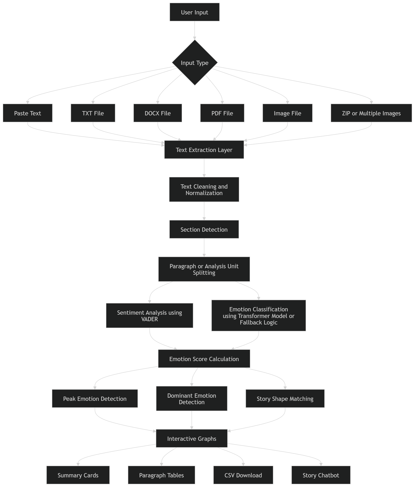

# Emotion Evolution in Stories

AI-powered narrative emotion analysis platform for stories, PDFs, images, DOCX files, and text using NLP, OCR, sentiment analysis, Transformer models, story-shape detection, and interactive visualization.

---

# Overview

Emotion Evolution in Stories is a unified narrative intelligence system designed to analyze emotional progression inside stories and documents.

Traditional sentiment analysis systems often produce different outputs for the same story when uploaded in different formats such as TXT, PDF, or images. This project solves that issue by building a unified preprocessing and normalization pipeline that converts every format into identical clean text before analysis begins.

The platform combines:

- OCR-based text extraction
- Sentiment analysis
- Emotion classification
- Story-shape detection
- Interactive visualization
- AI-powered chatbot interaction

into a complete narrative emotion analysis system.

---

# Problem Statement

Existing sentiment analysis tools suffer from:

- Different sentiment outputs across formats
- OCR extraction inconsistencies
- Poor paragraph-level understanding
- Lack of story-shape analysis
- Limited visualization capabilities

Example inconsistency:

| Format | Emotion Score |
|---|---|
| TXT | +0.42 |
| PDF | -0.18 |
| Image | +0.71 |

Even though the story is identical, the results become unreliable.

This project solves this issue by standardizing all formats before NLP processing.

---

# Features

- TXT, PDF, DOCX, image, ZIP, and direct text input support
- OCR-based text extraction
- Unified preprocessing and normalization pipeline
- Paragraph-level sentiment analysis
- Transformer-based emotion classification
- Peak emotion detection
- Dominant emotion identification
- Story-shape matching
- Interactive Plotly visualizations
- Hover-based paragraph previews
- Chapter-wise emotion analysis
- CSV export functionality
- PDF report generation
- AI-powered story chatbot
- Streamlit web application

---

# Technologies Used

- Python
- Streamlit
- Pandas
- Plotly
- NLTK
- VADER Sentiment Analysis
- Hugging Face Transformers
- DistilRoBERTa
- pytesseract OCR
- PIL
- OpenCV
- PyMuPDF
- pypdf

---

# Models and Algorithms

## Sentiment Analysis

The project uses VADER sentiment analysis to generate compound sentiment scores between:

- -1.0 → Strong Negative
- +1.0 → Strong Positive

---

## Emotion Classification

Transformer Model Used:

```python
j-hartmann/emotion-english-distilroberta-base
```

Detects:

- Joy
- Sadness
- Fear
- Anger
- Disgust
- Surprise
- Neutral

---

## Story Shape Detection

The system compares emotional progression against Kurt Vonnegut’s six narrative story shapes:

- Rags to Riches
- Tragedy
- Icarus
- Cinderella
- Oedipus
- Man in a Hole

using cosine similarity.

---

# Input Formats Supported

| Format | Supported |
|---|---|
| TXT | Yes |
| PDF | Yes |
| DOCX | Yes |
| JPG | Yes |
| PNG | Yes |
| WEBP | Yes |
| ZIP | Yes |
| Direct Text | Yes |

---

# System Architecture

```text
Input Layer
     ↓
Text Extraction
     ↓
Normalization Pipeline
     ↓
NLP Processing
     ↓
Emotion Detection
     ↓
Story Shape Matching
     ↓
Visualization & Reports
     ↓
Story Chatbot
```

---

# Architecture Diagram



---

# Project Workflow

## Step 1: Upload Input

The user uploads:

- TXT files
- PDF documents
- DOCX files
- Images
- ZIP archives
- Direct text input

---

## Step 2: Text Extraction

Different extraction methods are used based on file type.

| Format | Extraction Method |
|---|---|
| TXT | decode_text_bytes() |
| PDF | pypdf + fitz |
| DOCX | python-docx |
| Image | pytesseract OCR |
| ZIP | ZipFile walker |

---

## Step 3: Text Normalization

The extracted text is standardized using:

- Encoding correction
- Smart quote replacement
- Hyphen reconstruction
- OCR cleanup
- Header/footer removal
- Whitespace normalization

---

## Step 4: NLP Processing

The cleaned text is divided into approximately 100-word units.

Each unit undergoes:

- Sentiment analysis
- Emotion classification
- Peak detection

---

## Step 5: Story Shape Matching

The emotional progression is converted into an emotion arc and compared against predefined narrative templates using cosine similarity.

---

## Step 6: Output Generation

The application generates:

- Emotion graphs
- Story-shape analysis
- CSV exports
- PDF reports
- Interactive dashboards
- Chatbot responses

---

# Dataset Information

## Primary Dataset

### Frankenstein by Mary Shelley

Source:
Project Gutenberg

Dataset Details:

| Property | Value |
|---|---|
| Chapters | 24 |
| Letters | 4 |
| Words | ~75,000 |
| Analysis Units | ~320 |

---

# Results

## Frankenstein Analysis Results

| Metric | Result |
|---|---|
| Paragraphs Analyzed | 320 |
| Dominant Emotion | Fear |
| Peak Emotion | Joy (+0.82) |
| Story Shape | Man in a Hole |
| Similarity Score | 0.87 |
| Cross-Format Variance | < 0.02 |

---

# Performance Analysis

The system successfully achieved:

- Consistent outputs across multiple formats
- Reliable OCR extraction
- Stable emotion arc generation
- Accurate paragraph-level analysis
- Interactive visualization support

---

# Challenges Faced

## Format Inconsistency

Problem:
Different formats generated different sentiment outputs.

Solution:
Unified preprocessing and normalization pipeline.

---

## OCR Noise

Problem:
Scanned images introduced extraction errors.

Solution:
Image preprocessing before OCR extraction.

---

## Sentence Boundary Detection

Problem:
PDF extraction collapsed multiple sentences together.

Solution:
Custom sentence-splitting and paragraph reconstruction logic.

---

## Transformer Availability

Problem:
Transformer models require large downloads and compute resources.

Solution:
Implemented fallback emotion scoring using VADER and keyword-based methods.

---

# Limitations

Current limitations include:

- English-only support
- No labeled benchmark dataset
- OCR accuracy depends on image quality
- Transformer context length limitations
- Story shapes are heuristic approximations

---

# Future Enhancements

Future improvements may include:

- Multilingual support
- Character-level emotion tracking
- Speech emotion analysis
- LLM-powered narrative summaries
- Real-time storytelling analytics
- Corpus-level story comparison

---

# Project Structure

```text
emotion-evolution-project/
│
├── src/
│   ├── app.py
│   ├── preprocess.py
│   ├── sentiment_analysis.py
│
├── data/
├── outputs/
├── assets/
├── architecture/
├── presentation/
├── requirements.txt
└── README.md
```

---

# Installation

```bash
pip install -r requirements.txt
```

---

# Run the Project

```bash
streamlit run src/app.py
```

# Outputs

The project generates:

- Emotion graphs
- Story-shape visualizations
- Peak emotion summaries
- Interactive visualizations
- Chapter-wise emotion tracking
- CSV reports
- PDF reports
- Chatbot-based story insights

---
# Demo Video

Watch the complete project demo and walkthrough here:

🎥 [Emotion Evolution in Stories - Project Demo](https://www.youtube.com/watch?v=eamXlFsoxmM)

---

# Google Drive Resources

All project resources including presentation, demo video, reports, architecture diagrams, outputs, and additional materials can be accessed here:

🔗 [Project Google Drive Folder](https://drive.google.com/drive/folders/1coXJJe0sca_48qE2kVgRGKIZuFku37uD?usp=sharing)

---

# Conclusion

Emotion Evolution in Stories successfully demonstrates how Artificial Intelligence, OCR, Natural Language Processing, and interactive visualization can be combined into a unified narrative emotion analysis platform.

The project evolved from a simple sentiment analysis script into a complete multi-format narrative intelligence system capable of analyzing stories from TXT files, PDFs, images, DOCX documents, ZIP archives, and direct text input while maintaining highly consistent emotional outputs across all formats.

The strongest achievement of the project is the unified preprocessing pipeline that standardizes every format before NLP processing begins. This significantly improves reliability and ensures that the same story produces nearly identical emotion scores regardless of upload format.

The platform combines:

- OCR-based extraction
- Transformer-based emotion analysis
- Sentiment scoring
- Story-shape detection
- Interactive visualization
- Report generation
- AI-powered chatbot interaction

into one complete application suitable for literary analysis, storytelling research, educational tools, and narrative intelligence systems.

Future enhancements such as multilingual support, speech emotion analysis, character-level tracking, and large language model integration can further expand the project into a scalable narrative AI platform.

---

# Author

## Raahul Narayana Reddy Kummitha

## Saanvi Joginipally
