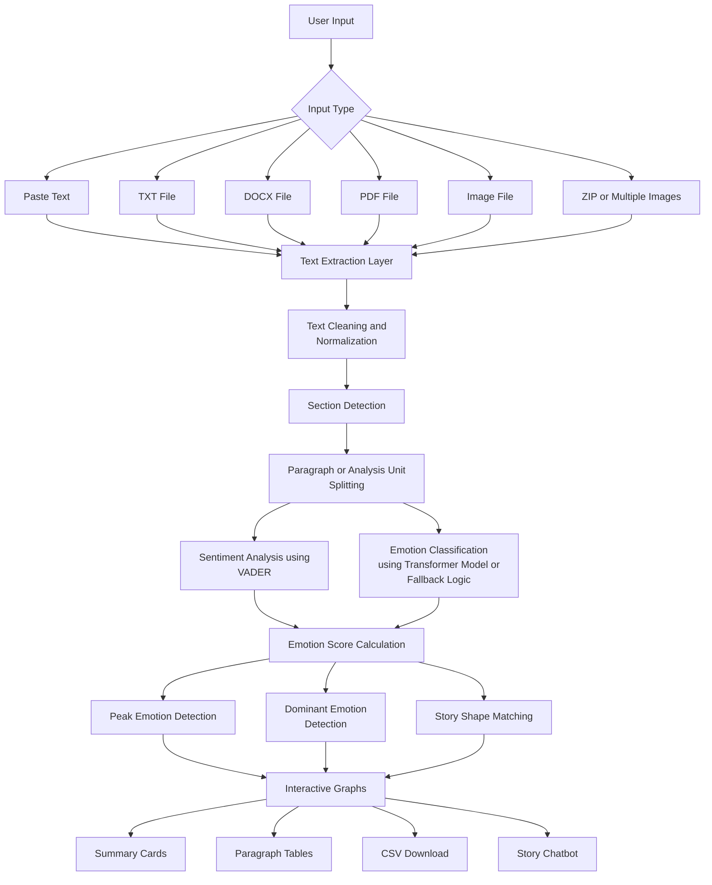

# Emotion Evolution in Stories: Narrative Emotion Analyzer

A multi-format web application for analyzing how emotions change across a story. The project extracts text from different input formats, cleans and normalizes the text, splits the story into meaningful sections, performs sentiment and emotion analysis, visualizes the emotional journey, and allows users to interact with the analyzed story through a chatbot.

---

## 1. Project Overview

This project began as a simple story sentiment analysis system using plain text. The first goal was to understand how emotions move across chapters, paragraphs, and sentences. Over time, it became a full Streamlit-based application that supports many input formats and produces visual, downloadable, and interactive results.

The main goal of the project is:

> Take story content from any supported format, convert it into clean text, analyze the emotional flow, and present the results in a clear dashboard.

The application supports:

- Direct pasted text
- TXT files
- DOCX files
- PDF files
- Image files
- ZIP files containing multiple files or images

---

## 2. Main Features

### Multi-Format Input Support

Users can either paste text directly or upload files. The project is designed so that all inputs pass through one common processing pipeline after extraction.

Supported formats include:

- `.txt`
- `.docx`
- `.pdf`
- `.jpg`
- `.jpeg`
- `.png`
- `.webp`
- `.zip`

### Text Extraction Layer

The application extracts text based on the uploaded input type. For example:

- TXT files are read directly.
- DOCX files are parsed using document text extraction.
- PDF files are converted into text using PDF extraction logic.
- Image files are processed using OCR.
- ZIP files are unpacked and processed file by file.

### Text Cleaning and Normalization

After extraction, the text is cleaned before analysis. This is important because PDFs, OCR images, and copied text can all contain different formatting issues.

The cleaning process handles:

- Extra spaces
- Broken line breaks
- PDF formatting artifacts
- OCR noise
- Page numbers
- Repeated headers or footers
- Encoding issues
- Hyphenated words
- Inconsistent paragraph spacing

### Section and Paragraph Detection

The cleaned story is divided into sections such as chapters, letters, or detected story parts. Each section is then split into paragraph-level analysis units.

This allows the project to analyze emotion at a more meaningful level instead of giving only one score for the whole story.

### Sentiment Analysis

The project uses VADER sentiment analysis to calculate sentiment scores. VADER returns a compound score between `-1` and `+1`.

- `-1` means strongly negative
- `0` means neutral
- `+1` means strongly positive

The score is then converted into labels such as:

- Strongly Positive
- Positive
- Neutral
- Negative
- Strongly Negative

### Emotion Classification

The application uses emotion classification logic to detect emotions such as:

- Joy
- Sadness
- Fear
- Anger
- Surprise
- Disgust
- Neutral

Depending on the setup, the project can use a transformer-based emotion model or fallback rule-based logic when the model is unavailable.

### Peak Emotion Detection

The app identifies the strongest emotional point in the story. This is done by finding the paragraph or analysis unit with the highest emotional intensity.

A peak emotion may be strongly positive or strongly negative. For example, the peak can represent joy, fear, sadness, anger, or another strong emotional moment.

### Dominant Emotion Detection

The system calculates which emotion appears most strongly or most frequently across the analyzed story.

### Story Shape Matching

The emotional flow can be compared with common story shapes such as:

- Rags to Riches
- Tragedy
- Icarus
- Cinderella
- Oedipus
- Man in a Hole

This helps connect raw sentiment scores with narrative structure.

### Interactive Graphs

The project includes interactive graphs that show how emotion changes across the story.

The graphs can show:

- Paragraph number
- Sentiment score
- Emotion label
- Peak emotional moments
- Emotional rise and fall
- Hover text with paragraph previews
- Story shape movement

### Result Tables

The app shows paragraph-wise or section-wise tables containing:

- Section name
- Paragraph number
- Extracted text preview
- Sentiment score
- Sentiment label
- Emotion label
- Emotion strength

### CSV Download

After analysis, users can download the results as CSV files. This makes it easier to save, submit, or inspect the results outside the web app.

### Story Chatbot

The project includes a chatbot-style interaction feature. After the story is processed, users can ask questions about the uploaded story and its emotional flow.

Example questions:

- What is the dominant emotion in the story?
- Which paragraph has the strongest emotion?
- What is the saddest part of the story?
- Summarize the emotional journey.
- What happens emotionally across the chapters?

---

## 3. Architecture Design

The following architecture represents the complete workflow of the Narrative Emotion Analyzer system from user input to final emotional visualization, downloadable outputs, and chatbot interaction.



### Architecture Explanation

#### 1. User Input Layer

The system begins by accepting user input in different formats such as pasted text, TXT files, DOCX files, PDFs, images, and ZIP folders.

#### 2. Input Type Detection

The application first identifies the uploaded input type and routes the file into the correct extraction logic.

#### 3. Text Extraction Layer

This layer converts all supported formats into plain text.

Examples:

- TXT files are directly read.
- PDF files are parsed using PDF extraction.
- Images are processed using OCR.
- ZIP files are unpacked and processed recursively.

#### 4. Text Cleaning and Normalization

After extraction, the text is cleaned and normalized so that all formats follow the same processing structure.

This stage removes:

- Extra spaces
- OCR artifacts
- Broken lines
- Page numbers
- Repeated headers and footers
- Encoding issues

#### 5. Section Detection

The application detects chapters, letters, or custom story sections automatically.

#### 6. Paragraph or Analysis Unit Splitting

Each section is divided into paragraph-level analysis units so that emotional changes can be tracked throughout the story.

#### 7. Sentiment Analysis Layer

The VADER sentiment analyzer calculates compound sentiment scores for every paragraph or analysis unit.

#### 8. Emotion Classification Layer

The project uses either:

- Transformer-based emotion classification
- Rule-based fallback emotion logic

This helps classify emotions such as joy, sadness, fear, anger, disgust, surprise, and neutral.

#### 9. Emotion Score Calculation

The sentiment and emotion outputs are combined to generate emotional intensity scores.

#### 10. Peak Emotion Detection

The strongest emotional point in the story is identified using emotional intensity calculations.

#### 11. Dominant Emotion Detection

The application determines which emotion dominates the narrative overall.

#### 12. Story Shape Matching

The emotional flow is compared against known story arc patterns such as:

- Cinderella
- Tragedy
- Icarus
- Rags to Riches
- Man in a Hole

#### 13. Interactive Graph Layer

The system generates visual emotional graphs showing:

- Emotional movement
- Paragraph-wise sentiment
- Peak emotion locations
- Hover previews
- Story progression

#### 14. Final Output Layer

The final outputs include:

- Summary cards
- Paragraph tables
- CSV download files
- Story chatbot interaction

---

## 4. End-to-End Project Flow

```text
User provides input
        ↓
App detects input type
        ↓
Text is extracted from the file or text box
        ↓
Extracted text is cleaned and normalized
        ↓
Sections or chapters are detected
        ↓
Text is split into paragraphs or analysis units
        ↓
VADER calculates sentiment scores
        ↓
Emotion classification detects emotions
        ↓
Peak and dominant emotions are calculated
        ↓
Story shape is matched
        ↓
Graphs and summary cards are generated
        ↓
Detailed tables are displayed
        ↓
User can download CSV results
        ↓
User can ask story-related questions using the chatbot
```

---

## 5. Folder Structure

Your ZIP file contains the following project structure:

```text
emotion_project/
│
├── Architecture.png
├── Emotion Evolution in Stories.pptx
│
├── assets/
│   ├── emotion-dashboard.png
│   ├── hero-emotion.png
│   └── manuscript-scan.png
│
├── data/
│   ├── frankenstein.txt
│   ├── Letter 2.txt
│   ├── Letter 2.pdf
│   ├── test data.pdf
│   ├── 15-05-2021-052358It-Ends-with-Us.pdf
│   ├── 15-05-2021-084550The-Alchemist-Paulo-Coelho.pdf
│   └── Letter 2-1,Letter 2-2/
│       ├── Letter 2-1.jpg
│       └── Letter 2-2.jpg
│
├── outputs/
│   ├── chapter_emotion_details.csv
│   ├── chapter_emotion_details.txt
│   ├── chapter_preview.txt
│   ├── emotion_flow.png
│   ├── sentiment_flow.png
│   ├── sentiment_results.csv
│   ├── initial upload output.pdf
│   ├── test.pdf
│   └── final output/
│       ├── chapter_one_paragraph_emotion_details.csv
│       ├── emotion_analysis_entire_process_76f2cafce9.pdf
│       ├── emotion_analysis_final_output_76f2cafce9.pdf
│       └── section_summary_results (1).csv
│
└── src/
    ├── app.py
    ├── paragraph_emotion_summary.py
    ├── plot_emotions.py
    ├── preprocess.py
    ├── sentiment_analysis.py
    └── __pycache__/
```

The main application file is:

```text
src/app.py
```

To run the Streamlit application, you should run it from the project root using:

```bash
streamlit run src/app.py
```

The `data/` folder contains sample story inputs, PDFs, text files, and image-based inputs used for testing. The `outputs/` folder contains generated analysis results such as CSV files, text outputs, graphs, and PDF outputs. The `assets/` folder contains UI and project images used in the application or documentation. The `src/` folder contains the main Python source code for preprocessing, sentiment analysis, emotion summaries, plotting, and the Streamlit app.

---

## 6. Installation Instructions

### Step 1: Clone the Repository

```bash
git clone https://github.com/your-username/emotion-project.git
```

### Step 2: Move into the Project Folder

```bash
cd emotion-project
```

### Step 3: Create a Virtual Environment

For Windows:

```bash
python -m venv venv
venv\Scripts\activate
```

For macOS or Linux:

```bash
python3 -m venv venv
source venv/bin/activate
```

### Step 4: Install Required Packages

```bash
pip install -r requirements.txt
```

If a `requirements.txt` file is not available, install the main libraries manually:

```bash
pip install streamlit pandas numpy plotly nltk vaderSentiment pillow pytesseract python-docx PyMuPDF transformers torch
```

---

## 7. OCR Setup for Image Inputs

For image-based text extraction, Tesseract OCR must be installed on the system.

### Windows

1. Download and install Tesseract OCR.
2. Add the Tesseract installation path to system environment variables.
3. Common path:

```text
C:\Program Files\Tesseract-OCR\tesseract.exe
```

If needed, set the path inside the Python code:

```python
pytesseract.pytesseract.tesseract_cmd = r"C:\Program Files\Tesseract-OCR\tesseract.exe"
```

### macOS

```bash
brew install tesseract
```

### Linux

```bash
sudo apt install tesseract-ocr
```

---

## 8. How to Run the Project

Run the Streamlit app using:

```bash
streamlit run app.py
```

After running the command, the app opens in the browser.

If it does not open automatically, go to:

```text
http://localhost:8501
```

---

## 9. How to Use the Application

### Option 1: Paste Text

1. Open the Streamlit app.
2. Paste the story text into the text input box.
3. Click the analyze button.
4. View the emotional summary, graphs, tables, and chatbot section.

### Option 2: Upload a TXT File

1. Upload a `.txt` file.
2. The app extracts the text directly.
3. Run the analysis.
4. View the results.

### Option 3: Upload a PDF File

1. Upload a `.pdf` file.
2. The app extracts text from the PDF.
3. The text is cleaned and normalized.
4. Run the analysis.
5. View graphs, summary cards, and downloadable results.

### Option 4: Upload a DOCX File

1. Upload a `.docx` file.
2. The app reads the document content.
3. Run the analysis.
4. View the output dashboard.

### Option 5: Upload an Image

1. Upload a `.jpg`, `.jpeg`, `.png`, or `.webp` file.
2. OCR extracts the visible text from the image.
3. The extracted text is cleaned.
4. Run the analysis.
5. View the results.

### Option 6: Upload a ZIP File

1. Upload a `.zip` file.
2. The app extracts supported files inside the ZIP.
3. Text is collected and combined.
4. Run the analysis.
5. View the final results.

---

## 10. How to View Results

After running the analysis, the application displays several result sections.

### Summary Cards

These cards show the main emotional findings, such as:

- Total analyzed sections
- Dominant emotion
- Average sentiment score
- Peak emotion
- Overall emotional direction

### Paragraph-Level Table

This table gives detailed analysis for each paragraph or analysis unit.

It usually includes:

- Section
- Paragraph number
- Text preview
- Sentiment score
- Sentiment label
- Emotion label
- Emotion intensity

### Interactive Emotion Graph

The graph shows the emotional movement of the story from beginning to end.

Users can hover over points to view:

- Paragraph preview
- Emotion label
- Sentiment score
- Emotional strength

### Peak Emotion Section

This section highlights the strongest emotional moment in the story.

It helps answer:

- Where is the emotional climax?
- What emotion is strongest?
- Which paragraph causes the strongest emotional response?

### Story Shape Result

This section explains whether the story follows a known emotional arc.

Examples:

- The story rises emotionally.
- The story falls into tragedy.
- The story has a recovery arc.
- The story follows a rise-fall-rise structure.

---

## 11. How to Download Results

After analysis, scroll to the download section.

The app provides a CSV download button.

Click the button to download the paragraph-wise emotion analysis results.

The CSV file can be opened in:

- Excel
- Google Sheets
- Python pandas
- Any text editor

The downloaded results are useful for:

- Project submission
- Further analysis
- Report writing
- Comparing different stories
- Saving experiment outputs

---

## 12. Story Chatbot Usage

The chatbot is used after the story has been processed.

It helps the user ask questions about the analyzed content.

Example questions:

```text
What is the main emotion in the story?
```

```text
Which paragraph has the peak emotion?
```

```text
Give me a summary of the emotional journey.
```

```text
Which section is the most negative?
```

```text
How does the story change from the beginning to the end?
```

The chatbot uses the extracted and analyzed story information to answer questions in a simple and understandable way.

---

## 13. Important Logic Used in the Project

### Sentiment Score Calculation

The VADER compound score is used to measure sentiment polarity.

```python
compound_score = analyzer.polarity_scores(text)["compound"]
```

### Peak Emotion Detection

The strongest emotional moment is found using absolute sentiment strength.

```python
peak_idx = df["Score"].abs().idxmax()
```

This works because both strong positive and strong negative emotions are important in storytelling.

### Emotion Classification

Emotion is detected using either:

- Transformer model prediction
- Fallback keyword and sentiment-based rules

This makes the application more reliable because it can still work even when the transformer model is not available.

### Text Normalization

All formats are cleaned before analysis so that TXT, PDF, DOCX, and image-based inputs follow the same pipeline.

This is one of the most important parts of the project because it improves result consistency.

---

## 14. Challenges Faced

### Challenge 1: Different Results for Different File Types

The same story produced different outputs when uploaded as TXT, PDF, or image.

Reason:

- PDF extraction changes line breaks.
- OCR can misread text.
- DOCX files preserve formatting differently.
- Copied text may contain hidden characters.

Solution:

- A common cleaning and normalization pipeline was added.

### Challenge 2: OCR Quality Issues

Image text extraction was sometimes inaccurate.

Reason:

- Low image quality
- Blurry text
- Poor lighting
- Complex page background
- Skewed image angle

Solution:

- Image preprocessing was added before OCR.

### Challenge 3: Graph Tooltip Text Was Not Fully Visible

Earlier graph hover text showed only partial paragraph content.

Solution:

- Long text was wrapped and shortened properly for hover display.

### Challenge 4: Summary Was Too Short

Initial summaries were too simple and did not feel like story-level summaries.

Solution:

- The summary logic was improved using section information, paragraph evidence, dominant emotion, and peak emotion.

### Challenge 5: UI Visibility Issues

Some text, headers, and checkbox labels were not clearly visible.

Solution:

- Custom CSS was added to improve readability, contrast, spacing, and layout.

---

## 15. What app.py Does

The `app.py` file is the main controller of the project.

It handles:

- Page configuration
- Streamlit UI layout
- File upload handling
- Text extraction
- Text cleaning
- Section detection
- Paragraph splitting
- Sentiment analysis
- Emotion classification
- Peak emotion detection
- Story shape matching
- Plotly graph generation
- Summary card rendering
- CSV download
- Story chatbot interaction

In simple words:

> `app.py` connects the frontend, backend logic, NLP processing, visualization, downloads, and chatbot into one complete application.

---

## 16. Expected Output

After running the project, the user should be able to see:

- Extracted story text
- Cleaned text preview
- Emotional summary cards
- Paragraph-level analysis table
- Interactive emotion graph
- Peak emotion result
- Dominant emotion result
- Story shape result
- CSV download button
- Story chatbot section

---

## 17. Example Workflow

```text
1. Open the app
2. Upload Frankenstein text as TXT or PDF
3. Click Analyze
4. App extracts and cleans the story
5. App detects sections and paragraphs
6. VADER calculates sentiment
7. Emotion logic classifies emotion
8. App finds peak and dominant emotion
9. App displays graphs and tables
10. User downloads CSV results
11. User asks chatbot questions about the story
```

---

## 18. Why This Project Is Useful

This project is useful because it combines technical NLP analysis with storytelling.

It can help users understand:

- How emotion changes in a story
- Where the emotional climax happens
- Which sections are positive or negative
- Which emotion dominates the narrative
- How the story structure changes over time

It can be useful for:

- Literature analysis
- Student projects
- Narrative research
- Creative writing review
- Digital humanities
- NLP demonstrations

---

## 19. Final Conclusion

This project started as a simple sentiment analysis script and developed into a complete narrative emotion analysis platform. It supports multiple input formats, uses text extraction and cleaning, performs sentiment and emotion analysis, visualizes the emotional journey, supports downloadable results, and includes a chatbot for story-based interaction.

The strongest part of the project is the unified processing pipeline. Instead of treating each input format separately after extraction, the system converts every input into clean text and sends it through the same analysis flow. This improves consistency and makes the app more reliable.

Overall, this project demonstrates practical skills in Python, Streamlit, NLP, OCR, file processing, data cleaning, visualization, and interactive AI application design.

---

## 20. GitHub Submission Notes

Before submitting the project, make sure the repository contains:

- `app.py`
- `requirements.txt`
- `README.md`
- Sample input files if allowed
- Screenshots of the app output
- Any required assets
- Clear instructions for running the app

Also make sure:

- The GitHub repository is public or access is granted.
- The app runs without missing files.
- The README explains installation, usage, results, downloads, and chatbot functionality.
- Large unnecessary files are not pushed to GitHub.
- API keys or private credentials are not included.

